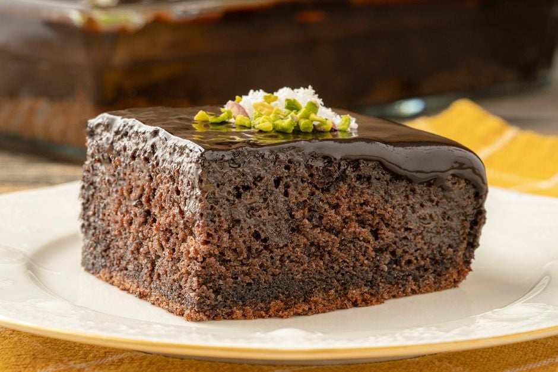

<!DOCTYPE html>
<html lang="tr">
<head>
    <meta charset="UTF-8">
    <meta http-equiv="X-UA-Compatible" content="IE=edge">
    <meta name="viewport" content="width=, initial-scale=1.0">
    <title>Document</title>
</head>
<body>
    <h1> 
        
 KAKAOLU ISLAK KEK

     </h1>

<html>
<head>
<title>Hizalama</title>
</head>
<body>
<h2  align="center"></h2>
</body>
</html>

        <ul>
            <li>Tarifimiz altı kişilik olup hazırlama süresi yirmi dakika, pişme süresi ise otuz dakikadır.</li>
            <li>Kekinizin daha iyi kabarması için; kabartma tozunu elenmiş un ile birlikte 1-2 damla limon suyu ilavesiyle ekleyebilirsiniz.</li>
            <li>Tadını seviyorsanız kek harcına portakal şekerlemesi ekleyebilirsiniz.</li>
        </ul>
         

        <h3> Kakolu Islak Kek Tarifi İçin Malzemeler</h3>
        <ul style="list-style-type:circle ;">
            <li>3 adet yumurta</li>
            <li>1 su bardağı toz şeker</li>
            <li>1 su bardağı süt</li>
            <li>1 su bardağı ayçiçek yağı</li>
            <li>1 paket vanilya</li>
            <li>2 yemek kaşığı kakao</li>
            <li>1 paket kabartma tozu</li>
            <li>1 su bardağı un</li> 
        </ul>
        
 Sosu İçin;

        <ul style="list-style-type:circle ;">
            <li>1 su bardağı süt</li>
            <li>4 yemek kaşığı kakao</li>
            <li>1 su bardağı toz şeker</li>
            <li>1 çay bardağı sıvı yağ</li>
            <li>1/2 çay kaşığı tuz</li>
        </ul>
         

        <h3> Kakaolu Islak Kek Tarifi Nasıl Yapılır?</h3>
        <ul type="A">
            <li>Islak kek tarifi için derin bir kasede yumurta ve şekeri aktarın.</li>
            <li>Şeker eriyip, karışım krema kıvamına gelene kadar çırpın.</li>
            <li>Ardından içerisine sütü, sıvı yağı ilave edin</li>
            <li>Vanilini de ekleyin. Koyup tekrar karıştırın.</li>
            <li>Topak kalmaması için kakao, kabartma tozu ve unu süzgeçten geçirin. Karışıma ekleyin son bir kez daha güzelce çırpın.</li>
            <li>Yağlanmış, ısıya dayanıklı bir kabın içerisine karışımı dökdükten sonra önceden ısıtılmış 180 derece fırında yaklaşık 30 dakika pişirin.</li>
            <li>Keki ıslatmak için bir sos tenceresinde süt, toz şekeri aktarın. Sıvı yağı da ilave edin.</li>
            <li>Kakao ve bir tutam tuzu karıştırıp bir taşım kaynatın.Kaynayınca ocaktan alın.</li>
            <li>Fırından çıkan sıcak kekin üzerine, hazırladığımız sıcak sosu dökün ve çekmesini bekleyin.</li>
            <li>Sosunu sünger gibi çeken iç kısmı yumuşacık ıslak keki dilimledikten sonra üzerine file badem serpiştirerek servis edin, sevdiklerinizle afiyetle tüketin.</li>
        </ul>
         
<a href="https://www.youtube.com/watch?v=eDk-8IdGjUc" target="_blank"> Islak Kek Tarifini Videolu İzlemek İsterseniz Lütfen Tıklayınız.</a>

<h3>
    
Afiyet Olsun

</h3>
</body>
</html>